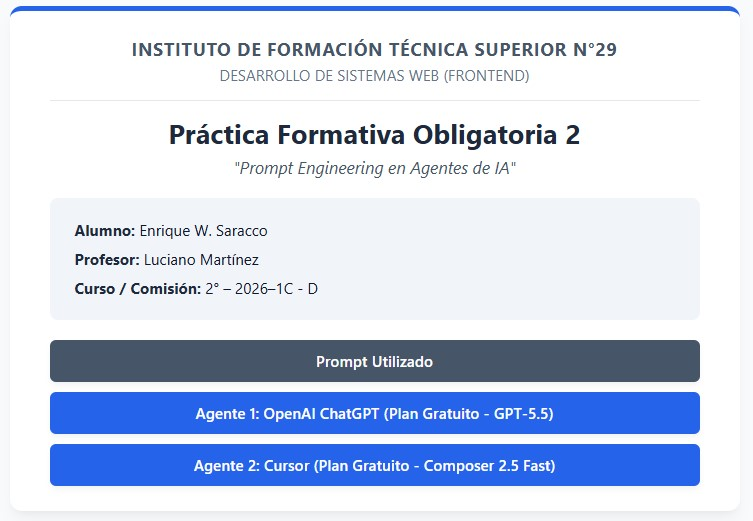
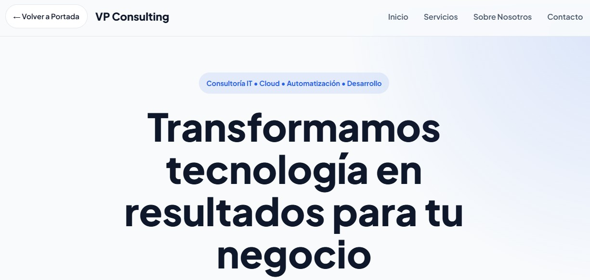
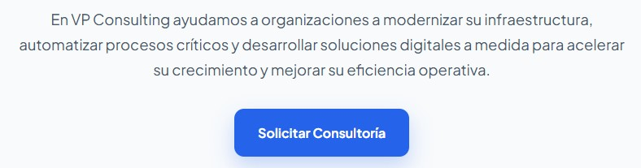
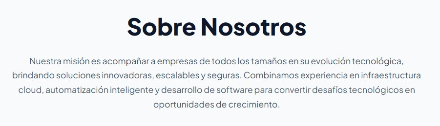
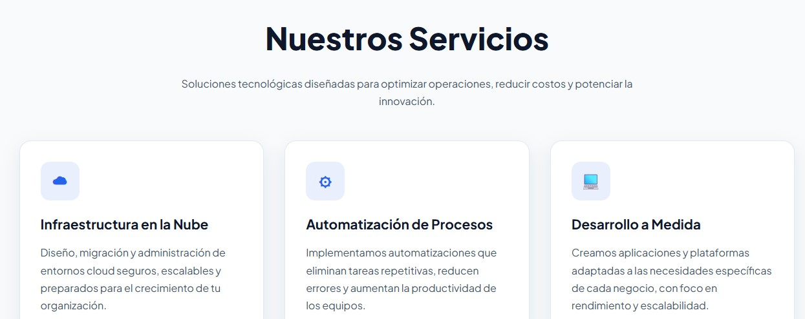
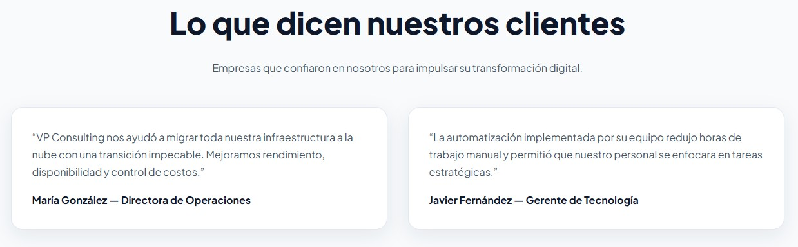
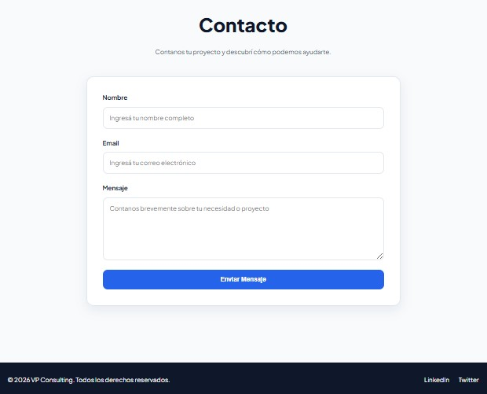
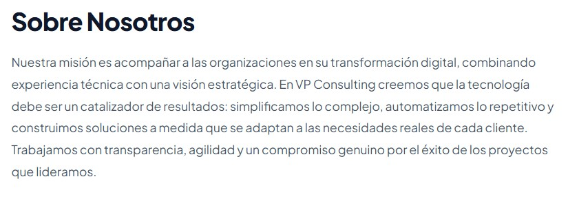
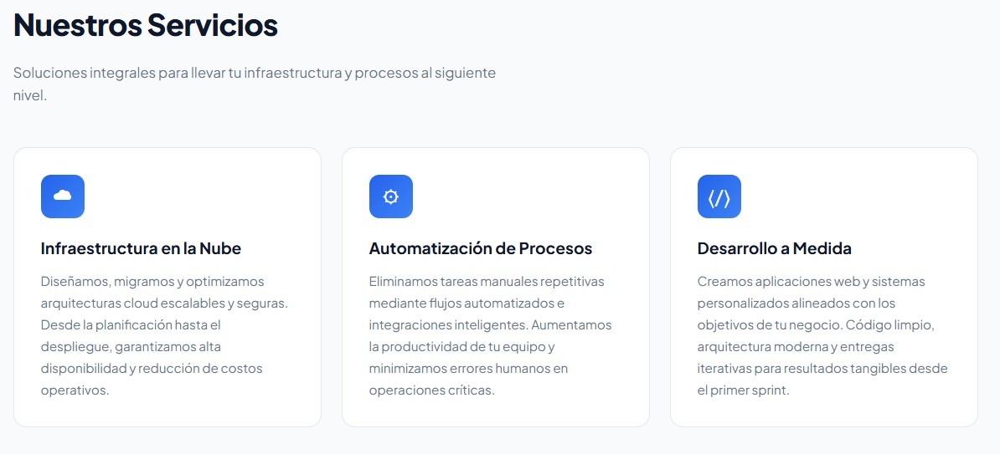
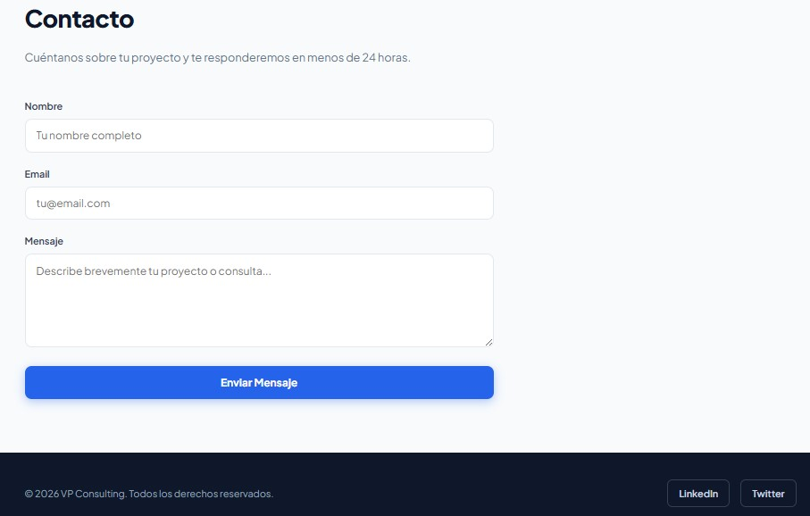

# Instituto de Formación Técnica Superior N°29

# Desarrollo de Sistemas Web (Frontend)
# Práctica Formativa Obligatoria 2: Prompt Engineering en Agentes de IA


* **Alumno:** Enrique W. Saracco
* **Profesor:** Luciano Martínez
* **Curso / Comisión:** 2° – 2026–1C - D

## Link al Deploy Unificado
Acceso al proyecto en producción a través del siguiente enlace de Vercel (el cual dirige a la carátula principal que contiene los tres accesos solicitados):
* **Despliegue en Vercel:** [https://pfo2-frontend-prompt-engineering.vercel.app/](https://pfo2-frontend-prompt-engineering.vercel.app/)

## Prompt Exacto Utilizado
A continuación se transcribe la estructura y los requisitos del prompt de ingeniería utilizado de forma idéntica para evaluar a ambos agentes de IA, OpenAI ChatGPT (Plan Gratuito - GPT-5.5) y Cursor (Plan Gratuito - Composer 2.5 Fast):

```text
Actúa como un Desarrollador Frontend Senior experto en UI/UX, especializado en HTML5 semántico y CSS3 moderno. 

Tu objetivo es generar el código completo de una Landing Page en un único archivo (HTML con el CSS integrado dentro de la etiqueta <style>) para que pueda visualizarse directamente en el navegador sin configuraciones adicionales.

<CONTEXTO>
La empresa se llama "VP Consulting". Es una consultora IT que ofrece servicios de infraestructura en la nube, automatización de procesos y desarrollo a medida. El diseño debe ser moderno, profesional, tecnológico y responsive.
</CONTEXTO>

<IDIOMA_Y_CONVENCIONES>
- Código y Comentarios (Uso Interno): Todo el código técnico subyacente, incluyendo nombres de clases CSS, IDs, atributos de formulario y los comentarios educativos o explicativos dentro del archivo, debe escribirse estrictamente en inglés.
- Interfaz y Contenido (Uso Externo): Todo el texto que sea visible para el usuario final en la pantalla debe estar redactado en español fluido, natural y profesional. Esto incluye títulos, menús, botones, etiquetas de formularios, marcadores de posición (placeholders) y testimonios. No uses "Lorem Ipsum".
</IDIOMA_Y_CONVENCIONES>

<LINEAMIENTOS_DE_DISEÑO>
- Paleta de colores: Usa un enfoque tecnológico y limpio. Fondo claro (#f8fafc o similar), texto principal oscuro (#0f172a), y un azul eléctrico o celeste moderno (#2563eb) como color de acento para botones y elementos clave.
- Tipografía: NO utilices las fuentes por defecto del sistema. Debes importar una tipografía moderna y profesional desde Google Fonts (como 'Plus Jakarta Sans', 'Inter' o 'Montserrat') incluyendo su respectiva etiqueta <link> dentro del <head> del documento, y aplicarla como la fuente principal para todo el sitio.
- Espaciado: Aplica márgenes y paddings generosos a las secciones para que el diseño respire y se vea premium.
- Interactividad: Agrega efectos visuales suaves (transiciones) cuando el usuario pase el mouse (hover) por los botones y los enlaces del menú.
- Responsividad y Fluidez Extrema: La página debe adaptarse perfectamente a teléfonos celulares, tablets y pantallas de PC de cualquier tamaño. Si el usuario achica la ventana de la PC de forma manual, el contenido debe reordenarse fluidamente y adaptarse sin recortarse nunca, sin generar barras de desplazamiento horizontal y sin encimarse. Asegúrate de incluir la etiqueta <meta name="viewport" ...> adecuada en el <head> y usar propiedades como max-width, Flexbox/Grid con envoltura (wrap) y media queries donde sea necesario.
</LINEAMIENTOS_DE_DISEÑO>

<REQUISITOS_ESTRICTOS>
Debes incluir obligatoriamente las siguientes secciones en orden, utilizando etiquetas HTML5 semánticas (<header>, <nav>, <main>, <section>, <footer>):
1. Header: Debe incluir, en una esquina o al inicio de la navegación, un botón o enlace estético que diga "← Volver a Portada" y que apunte estrictamente a "../index.html" para regresar a la carátula principal. Asimismo, debe contener el logo de VP Consulting (solo texto) y un menú de navegación funcional con enlaces ancla (textos visibles en español: Inicio, Servicios, Sobre Nosotros, Contacto). En dispositivos móviles, tanto el botón "Volver" como el menú deben acomodarse de forma estética y responsiva.
2. Hero Section: Una sección principal de alto impacto visual. Debe tener un título llamativo (H1), un subtítulo descriptivo y un botón de llamada a la acción (CTA) que diga "Solicitar Consultoría".
3. Sobre Nosotros: Un breve párrafo (H2) que describa la misión de la consultora IT.
4. Servicios: Una sección (H2) con al menos 3 tarjetas (cards) distribuidas con Flexbox o CSS Grid que destaquen los servicios ofrecidos.
5. Testimonios: Una sección (H2) con 2 reseñas breves de clientes ficticios en un formato estético de tarjetas.
6. Formulario de Contacto: Maquetado visual completo (H2) con campos para Nombre, Email, Mensaje (etiquetas y placeholders en español) y un botón de envío que diga "Enviar Mensaje". No requiere funcionalidad backend.
7. Footer: Pie de página con derechos de autor en español y enlaces ficticios a LinkedIn y Twitter.
</REQUISITOS_ESTRICTOS>

<RESTRICCIONES>
- NO entregues el código por partes. Entrega un único bloque de código completo y finalizado.
- NO uses frameworks externos (ni Bootstrap, ni Tailwind), utiliza únicamente CSS Vanilla.
- El archivo debe ser completamente funcional al guardarse como index.html y abrirse directamente en un navegador moderno.
- No omitas ninguna sección ni utilices comentarios como "resto del código..." o "continúa aquí".
- Debes entregar el archivo completo sin abreviaciones.
</RESTRICCIONES>

Procede a generar el código.
```

## Capturas de Pantalla

### Portada Principal


---

### 1. Sitio Web Generado por el Agente 1, OpenAI ChatGPT (Plan Gratuito - GPT-5.5)







---

### 2. Sitio Web Generado por el Agente 2, Cursor (Plan Gratuito - Composer 2.5 Fast)




